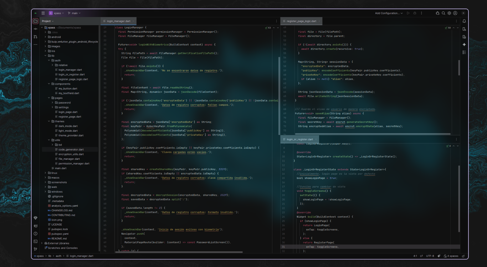
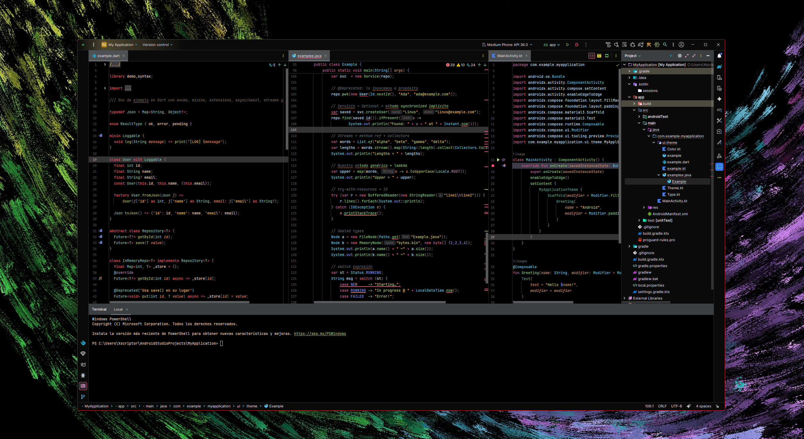
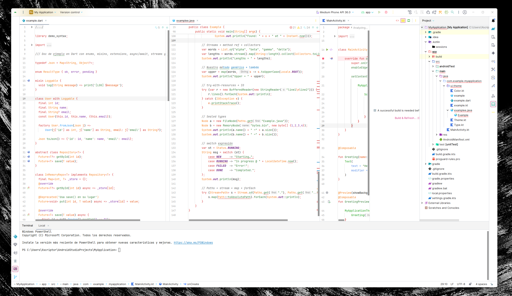
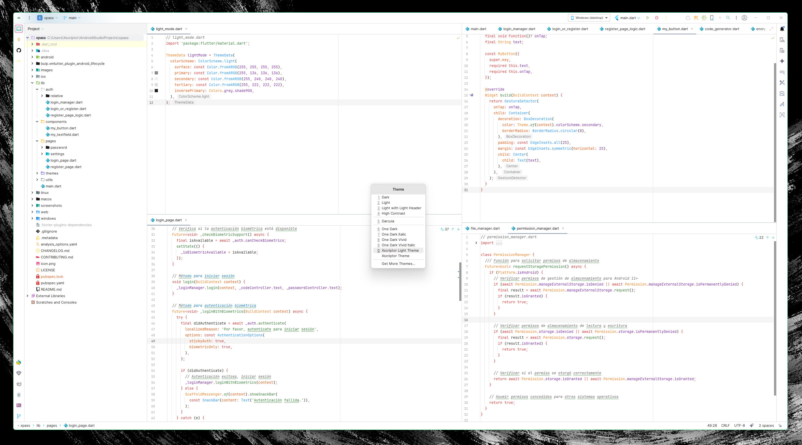
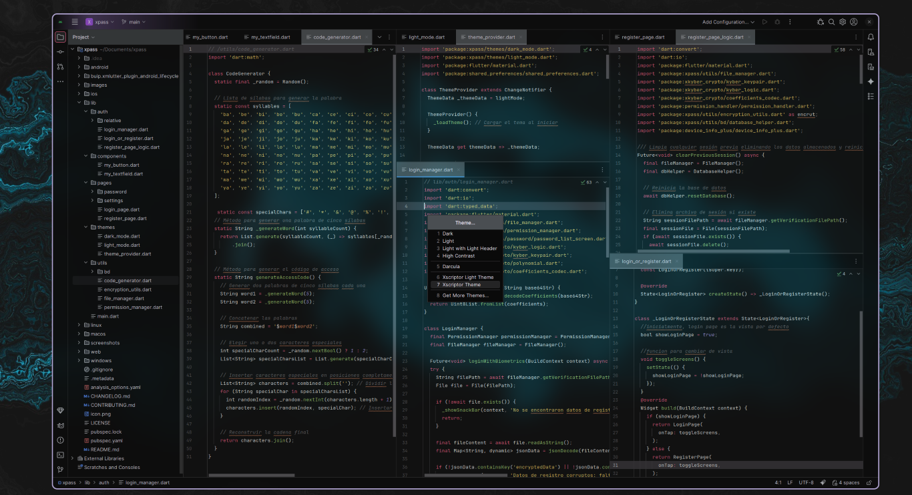

<h1 align="center"> Xscriptor Jetbrains </h1>

A centralized collection of resources, themes, and configurations designed to enhance the development experience across the JetBrains IDE family. This repository serves as the core for the Xscriptor ecosystem, integrating visual enhancements, accessibility adjustments, and UI modifications.

     

## Structure

- **[xscriptor-theme](./xscriptor-theme)**: The main theme pack for Android Studio and IntelliJ IDEA.
- **[assets](./assets)**: Resources like icons and branding for the Xscriptor ecosystem.

## Preview

  

  
More

  <table>
    <tr>
      <td align="center">
        
      </td>
      <td align="center">
        
      </td>
      <td align="center">
        
      </td>
      <td align="center">
        
      </td>
    </tr>
  </table>

## License

[MIT License](./xscriptor-theme/LICENSE)

## Contributing

Contributions are welcome! Please feel free to submit issues and pull requests.
