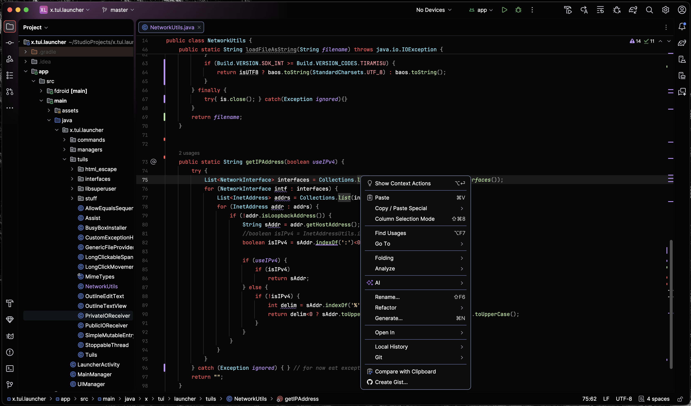
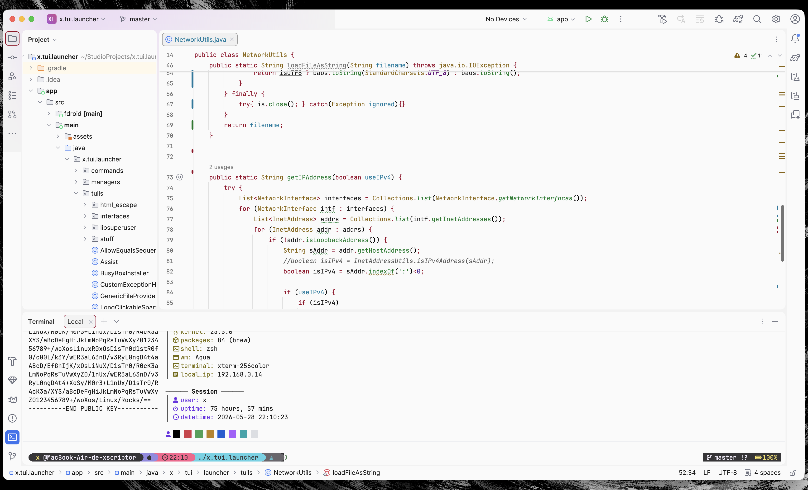
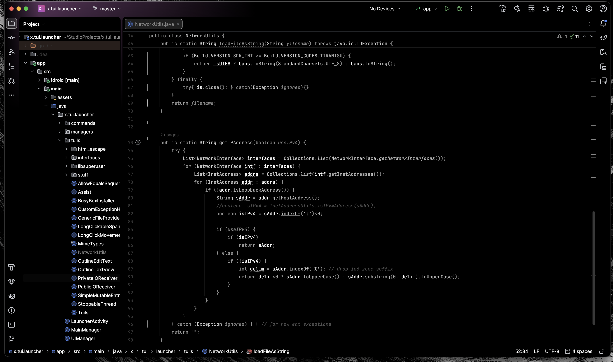
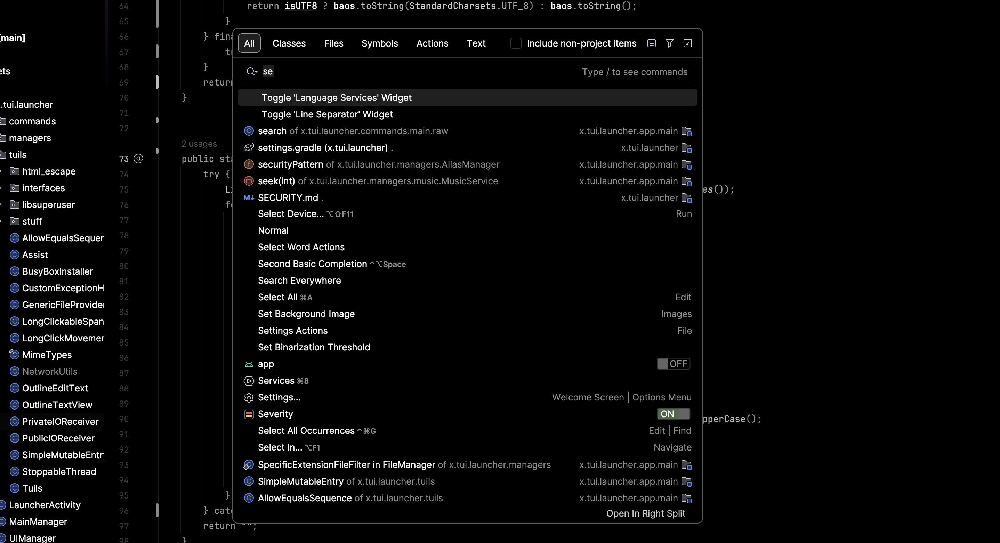
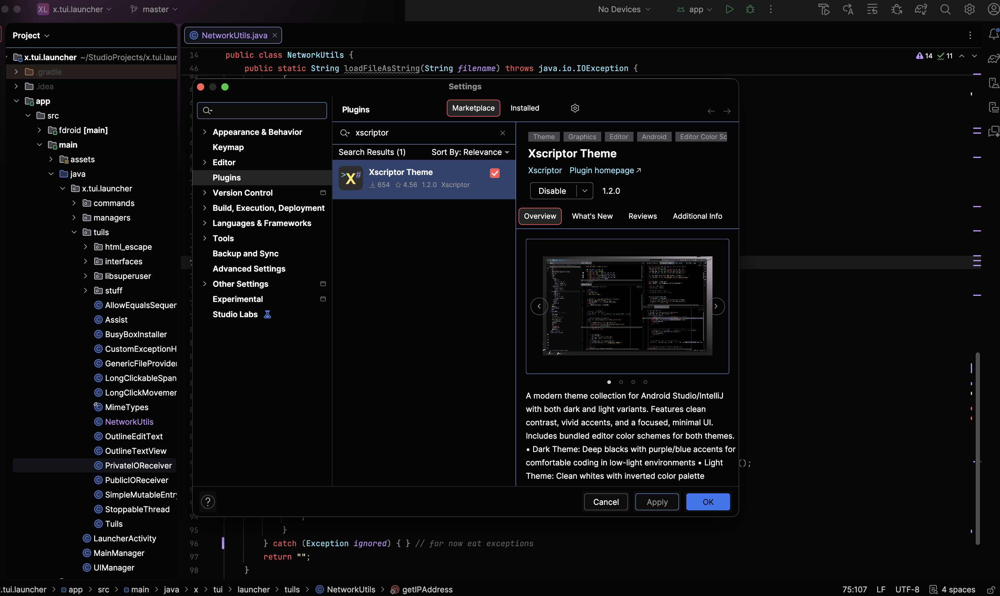

<h1 align="center"> Jetbrains - Xscriptor</h1>

A centralized collection of resources, themes, and configurations designed to enhance the development experience across the JetBrains IDE family. This repository serves as the core for the Xscriptor ecosystem, integrating visual enhancements, accessibility adjustments, and UI modifications.

  

<h2 align="center">Contents</h2>

  <a href="#structure">Structure</a> •
  <a href="#preview">Preview</a> •
  <a href="#related-documents">Related Documents</a> •
  <a href="x">X</a>

<h2 align="center" id="structure"> Structure </h2>

<ul>
  <li><b><a href="./xscriptor-theme">xscriptor-theme</a></b>: The main theme pack for Android Studio and IntelliJ IDEA.</li>
  <li><b><a href="./xscriptor-theme/scripts/docs">scripts/docs</a></b>: Theme generator script documentation and usage guide.</li>
  <li><b><a href="./assets">assets</a></b>: Resources like icons and branding for the Xscriptor ecosystem.</li>
  <li><b><a href="./docs">docs</a></b>: Build instructions for Arch Linux, Ubuntu, and Windows.</li>
  <li><b><a href="./colors.md">colors.md</a></b>: 16-color palette definitions for all 12 themes.</li>
</ul>

<h2 align="center" id="preview"> Preview </h2>

  

  
More

  <table align="center">
    <tr>
      <td align="center">
        
      </td>
      <td align="center">
        
      </td>
    </tr>
    <tr>
      <td align="center">
        
      </td>
      <td align="center">
        
      </td>
    </tr>
  </table>

<h2 align="center" id="related-documents">Related Documents</h2>

<ul>
  <li><a href="./LICENSE">License</a></li>
  <li><a href="./CODE_OF_CONDUCT.md">Code of Conduct</a></li>
  <li><a href="./CONTRIBUTING.md">Contributions</a></li>
  <li><a href="./ROADMAP.md">Roadmap</a></li>
</ul>

<h2 align="center" id="x">X</h2>

<a href="https://github.com/xscriptor">XGitHub</a> &middot;
<a href="https://dev.xscriptor.com">XWeb</a>

